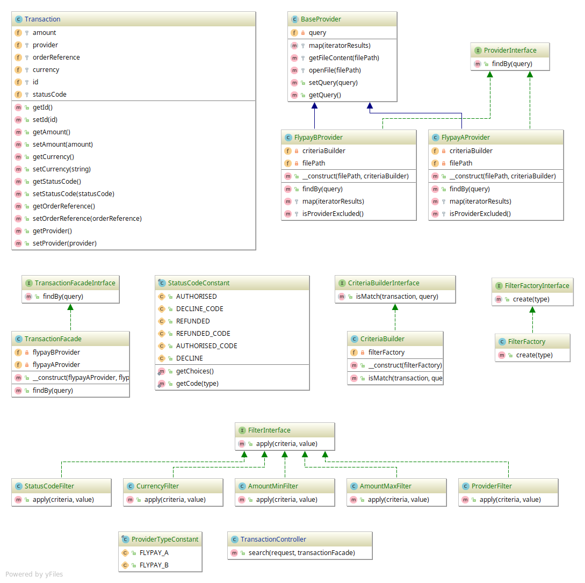

## Fly365

### Requirement

- Checkout [Fly365 task](https://github.com/fly365com/code-challenge/blob/master/backend-challenge/backend-challenge.md)

### Class diagram



### Efficiency of parsing streams/files

Following table demonstrates a concept of the difference:

| # | String items in memory at a time	 | Decoded PHP items in memory at a time | Total |
| :---         |     :---:      |          ---: | ---: |
| json_decode   | 10000 | 10000 | 20000 |
| JsonMachine::fromStream    | 1       | 1      | 2 |

This means, that `Streaming` is constantly efficient for any size of processed JSON. 100 GB no problem.


## End point
- A REST API application to get transactions from multiple provider with criteria

- GET `[base-url]/api/payment/transaction`
- Response 
```json
{
    "transactions": [
        {
            "id": "flypay-a-0001",
            "amount": 99,
            "currency": "aud",
            "statusCode": 1,
            "orderReference": "2e58bd43-0001",
            "provider": "flypayA"
        }, {
            "id": "flypay-a-0007",
            "amount": 4,
            "currency": "aud",
            "statusCode": 1,
            "orderReference": "2e58bd43-0007",
            "provider": "flypayA"
        }
    ]
}
```

##### Criteria Examples:

- link `[base-url]/api/payment/transaction?statusCode=authorised&amountMax=1000&amountMin=500&provider=flypayA`

- amountMin `/api/payment/transaction?amountMin=300` requirements=`"\d+"`
- amountMax `/api/payment/transaction?amountMax=900` requirements=`"\d+"`
- currency `/api/payment/transaction?currency=usd` requirements=`"[a-z]+"`
- statusCode `/api/payment/transaction?statusCode=authorised` requirements=`"[a-z]+"`
- provider `/api/payment/transaction?provider=flypayA` requirements=`"[a-z]+"`

### Installing

- Create `.env` file from `.env.dist`
- Run `docker-compose build`
- Run `docker-compose up -d`
- Run `docker-compose run php composer install` to install the dependencies.
- Run `docker-compose up`

### Running the tests

- Run `docker-compose run php /www/vendor/bin/phpunit`

### Built With

* [PHP7.2](http://php.net)
* [Symfony4](http://www.symfony.com) 
* [jms/serializer](https://jmsyst.com/libs/serializer) - Library for (de-)serializing data of any complexity; supports XML, JSON

Please read the following docs:
- [Installing the application](docs/install.md)
